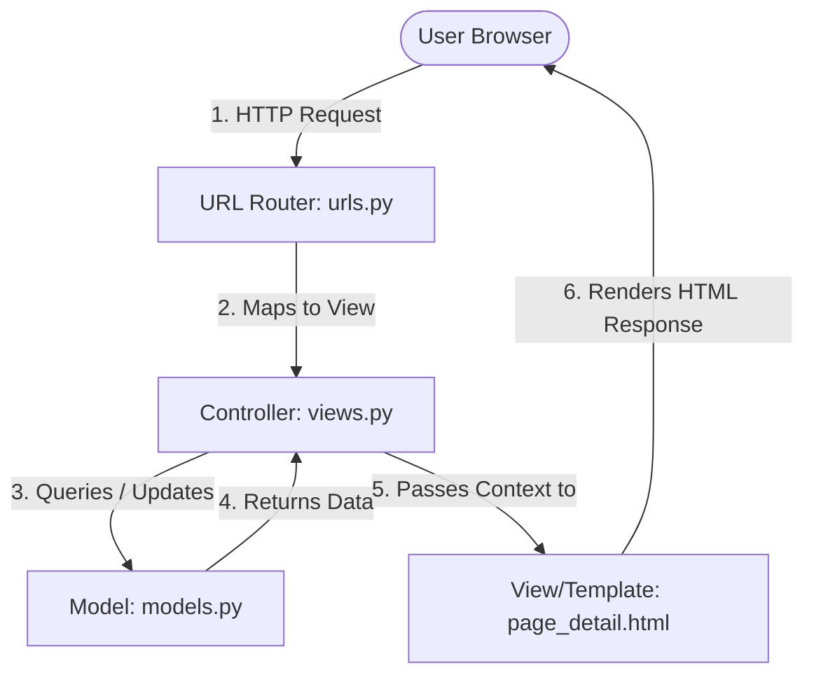

# Understanding the MVC Pattern in this Django Project

This document explains how the **Model-View-Controller (MVC)** architectural pattern is implemented in this codebase. 

While Django is technically described as a **Model-View-Template (MVT)** framework, it is simply a variation of the classic MVC pattern. Here is how the components map to this project:



---

## 1. The Model (Data Layer)
The **Model** represents the database schema, data structures, and business logic. It handles saving, retrieving, and validating data.

* **File in this project:** [models.py](file:///Users/spencergraham/Desktop/other/website-redux/william_hazard_project/website/models.py)
* **Example:** The [Page](file:///Users/spencergraham/Desktop/other/website-redux/william_hazard_project/website/models.py#L6-L13) model defines what a site page consists of:
  ```python
  class Page(models.Model):
      title = models.CharField(max_length=200)
      slug = models.SlugField(unique=True)
      content_markdown = models.TextField()
      updated_at = models.DateTimeField(auto_now=True)
  ```
  It is also responsible for model-specific behaviors like compressing uploaded images or converting uploaded video assets on save.

---

## 2. The Controller (Business Logic Layer)
The **Controller** orchestrates the application flow. It intercepts incoming requests, fetches/mutates data using the models, and selects which user interface (template) to return. 

In Django, this responsibility is split between the **URL router** and the **Django views**:

### A. The Router
* **File in this project:** [urls.py](file:///Users/spencergraham/Desktop/other/website-redux/william_hazard_project/website/urls.py)
* Maps the requested URL pattern (e.g. `/log/`) to a view handler function:
  ```python
  path('log/', views.log_index, name='log_index'),
  ```

### B. The Views
* **File in this project:** [views.py](file:///Users/spencergraham/Desktop/other/website-redux/william_hazard_project/website/views.py)
* **Example:** The `log_index` view handles rendering the list of blog entries:
  ```python
  def log_index(request):
      # 1. Controller fetches data from the Model
      entry_list = LogEntry.objects.all()
      paginator = Paginator(entry_list, 10)
      page_number = request.GET.get('page')
      page_obj = paginator.get_page(page_number)
      
      # 2. Controller passes data (context) to the View/Template to render
      return render(request, 'log_index.html', {'page_obj': page_obj})
  ```

---

## 3. The View (Presentation Layer)
The **View** (referred to as the **Template** in Django) defines how the data is displayed to the user. It is responsible only for presentation logic, receiving data from the controller and rendering it as HTML.

* **Files in this project:** `templates/` directory (e.g., [page_detail.html](file:///Users/spencergraham/Desktop/other/website-redux/william_hazard_project/templates/page_detail.html) or [log_index.html](file:///Users/spencergraham/Desktop/other/website-redux/william_hazard_project/templates/log_index.html))
* **Example:** The template renders the data passed by the controller using Django template syntax:
  ```html
  
    <h1>{{ page.title }}</h1>
    <div class="content">
      {{ page.content_markdown }}
    </div>
  
  ```

---

## MVC vs. MVT Comparison

| Classical MVC Concept | Django (MVT) Equivalent | File/Role in This Project |
|---|---|---|
| **Model** | **Model** | [models.py](file:///Users/spencergraham/Desktop/other/website-redux/william_hazard_project/website/models.py) – Manages the data schema & database access. |
| **Controller** | **View** (+ URLs) | [views.py](file:///Users/spencergraham/Desktop/other/website-redux/william_hazard_project/website/views.py) / [urls.py](file:///Users/spencergraham/Desktop/other/website-redux/william_hazard_project/website/urls.py) – Handles URL matching and handles HTTP requests. |
| **View** | **Template** | `templates/` – Renders the final layout and content for the browser. |
